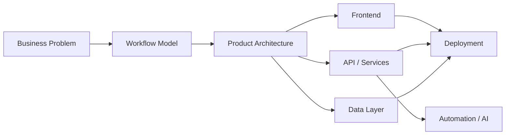

<div align="center">

# IBRAHIM KHAN JAGWAL

### FULL-STACK ENGINEER · SAAS BUILDER · SYSTEMS THINKER

`Karachi, Pakistan` · `Building software around real business operations`

<br/>

<a href="https://www.linkedin.com/in/ibrahim-khan-jagwal/">
  
</a>
<a href="mailto:ibrahim.khan.jagwal@gmail.com">
  
</a>
<a href="https://www.ua-technologies.com/">
  
</a>

<br/><br/>


</div>

---

## `01 / PROFILE`

```txt
> whoami

Ibrahim Khan Jagwal

Full-stack developer focused on building software that sits close to
real business operations: SaaS products, internal platforms, automation,
ERP-style systems, dashboards, APIs, integrations and cloud-deployed apps.

I care about architecture, product clarity, reliability and shipping.
The goal is not "more code". The goal is a system that actually works.
```

### What I optimize for

| | |
|---|---|
| **Product** | Clear workflows, useful features, low-friction UX |
| **Architecture** | Modular systems, clean boundaries, maintainable code |
| **Backend** | APIs, auth, permissions, data models, integrations |
| **Frontend** | Fast interfaces, practical dashboards, responsive UI |
| **Infrastructure** | Docker, Linux, deployment, domains, reverse proxies |
| **Automation** | AI-assisted workflows, operational tooling, scraping |

---

## `02 / ENGINEERING STACK`

<div align="center">

<table>
<tr>
<td valign="top" width="33%">

### Interface
`React`  
`Next.js`  
`TypeScript`  
`Tailwind CSS`  
`GSAP`

</td>
<td valign="top" width="33%">

### Systems
`Node.js`  
`Express`  
`Python`  
`PHP / Laravel`  
`REST APIs`

</td>
<td valign="top" width="33%">

### Data + Ops
`PostgreSQL`  
`Prisma`  
`MySQL`  
`Docker`  
`Linux`

</td>
</tr>
</table>

</div>



---

## `03 / SYSTEMS I LIKE BUILDING`

### 01. Modular SaaS Platforms
Products where organizations can activate only the capabilities they need while sharing a strong core for identity, access, tenancy and permissions.

`multi-tenant` `RBAC` `organizations` `module registry` `auditability`

### 02. ERP + Operations Software
Systems that map real workflows: accounting, purchases, sales, inventory, CRM, users, approvals and reporting.

`business logic` `workflows` `relational data` `permissions`

### 03. AI + Automation
Practical AI where it removes repetitive work, assists decisions or connects fragmented processes instead of existing as a demo feature.

`agents` `LLM integration` `workflow automation` `data extraction`

### 04. Infrastructure-Aware Products
Applications designed with deployment, networking, domains, containers, performance and maintainability in mind from the beginning.

`Docker` `Linux` `Nginx` `Vercel` `Cloudflare`

---

## `04 / SELECTED BUILDS`

<table>
<tr>
<td width="50%" valign="top">

### ◼ Unified Social Inbox
A unified operations layer for handling WhatsApp, Instagram, Facebook and email conversations from one interface.

**Engineering focus**  
Real-time messaging, API integration, data synchronization and operator workflows.

`Node.js` `Express` `React` `Prisma` `Socket.IO`

</td>
<td width="50%" valign="top">

### ◼ Modular ERP Platform
A business platform designed around independent modules that can operate separately or connect into a larger ERP.

**Engineering focus**  
Organizations, memberships, roles, company access, permissions, module activation and accounting integration.

`Next.js` `Node.js` `TypeScript` `Prisma` `PostgreSQL`

</td>
</tr>
<tr>
<td width="50%" valign="top">

### ◼ AI Proposal Automation
A workflow for discovering jobs, scoring opportunities and assisting proposal generation through browser and backend automation.

**Engineering focus**  
Automation pipelines, browser extensions, scoring logic and backend orchestration.

`Python` `Flask` `Manifest V3` `Socket.IO`

</td>
<td width="50%" valign="top">

### ◼ Lead Intelligence Tooling
Async discovery systems for finding businesses, extracting useful public information and structuring it for outreach workflows.

**Engineering focus**  
Parallel scraping, browser automation, structured exports and operator-friendly tools.

`Playwright` `Asyncio` `Flask` `Excel`

</td>
</tr>
<tr>
<td width="50%" valign="top">

### ◼ Real-Time Chat Platform
A custom communication system designed around private conversations, file transfer and a path toward end-to-end encryption.

**Engineering focus**  
Authentication, realtime events, scalable message delivery and secure client architecture.

`Next.js` `Express` `TypeScript` `PostgreSQL` `Docker`

</td>
<td width="50%" valign="top">

### ◼ Multi-Service Deployment
Production-style deployments with multiple frontends, APIs, databases, domains and reverse-proxy routing.

**Engineering focus**  
Containerization, SSL, routing, environment separation and service operations.

`Docker` `Nginx` `PostgreSQL` `Cloudflare` `Linux`

</td>
</tr>
</table>

---

## `05 / HOW I THINK ABOUT SOFTWARE`

```txt
BAD:
feature -> code -> ship -> fix chaos later

BETTER:
problem
  -> workflow
  -> domain model
  -> architecture
  -> interface
  -> implementation
  -> observability
  -> iteration
```

I prefer software that is **boring in production and impressive in capability**.

That usually means fewer hidden assumptions, stronger boundaries, deliberate permissions, predictable data models, reversible decisions and enough documentation that the next developer does not have to reverse-engineer the system.

---

## `06 / CURRENT DIRECTION`

```yaml
focus:
  - modular SaaS architecture
  - ERP and business software
  - AI-enabled operations
  - developer tooling
  - cloud and infrastructure
  - productized software services

interested_in:
  - difficult business workflows
  - systems that need to scale beyond an MVP
  - automation with measurable operational value
  - long-term technical partnerships
```

---

## `07 / GITHUB SIGNAL`

<div align="center">


<br/><br/>


</div>

---

<div align="center">

## `08 / LET'S BUILD SOMETHING USEFUL`

I am interested in serious software projects, SaaS products, automation systems and technical partnerships where engineering has a direct business outcome.

<br/>

<a href="mailto:ibrahim.khan.jagwal@gmail.com">
  
</a>

<br/><br/>

`BUILD SYSTEMS. REMOVE FRICTION. CREATE LEVERAGE.`

</div>
